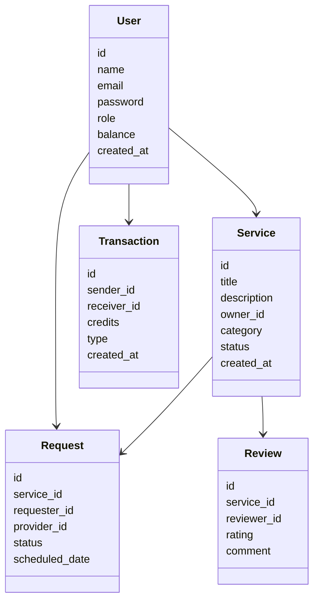
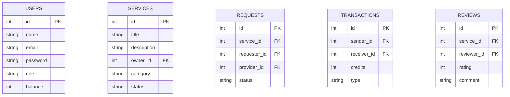
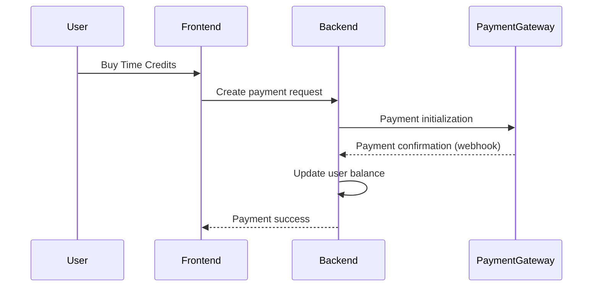
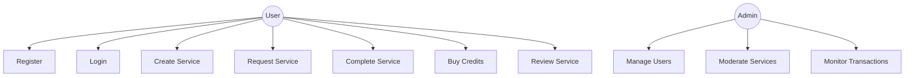
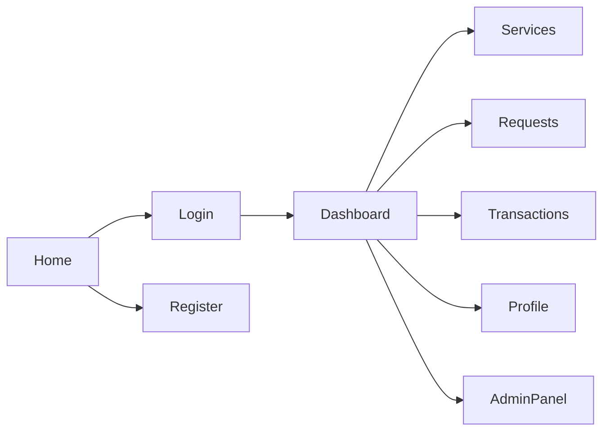

# 1. Project Overview

## 1.1 Introduction

The **Time Bank Platform** is a web-based peer-to-peer system that enables users to exchange services using a virtual currency called **time credits**. Instead of paying with traditional money, users earn credits by providing services and spend them when requesting services from other users.

The system is designed to promote collaboration, knowledge sharing, and mutual support within a community. Each hour of service provided corresponds to a specific number of time credits that can later be used to obtain services from other participants.

The application will follow modern web engineering practices, including:
- MVC architecture
- RESTful API design
- Token-based authentication
- Secure communication between services
- Modular and scalable design
- Responsive frontend interface

The system will also support integration with an external payment provider that allows users to purchase time credits.

---
## 1.2 Objectives
The main objectives of the project are:
### Functional Objectives
- Allow users to register and manage their profiles.
- Enable users to offer services to the community.
- Allow users to search and request services.
- Implement a workflow for managing service requests.
- Manage a virtual currency system based on time credits.
- Track all credit transactions in the system.
- Allow users to review and rate completed services.
- Provide administrative tools for system moderation.
- Integrate an external payment gateway to purchase time credits.
### Technical Objectives
- Implement a scalable web application using MVC architecture.
- Separate frontend and backend responsibilities.
- Implement two independent backends:
    - Main application backend
    - Payment gateway backend
- Ensure secure authentication using JWT tokens.
- Provide a clean and documented REST API.
- Maintain code quality through modular design.
---
## 1.3 System Scope
The system will cover the following areas:

### User Management
Users can create accounts, authenticate, manage their profiles, and participate in service exchanges.

### Service Marketplace
Users can publish services they offer and discover services offered by others.

### Service Requests Workflow
Users can request services and providers can manage those requests.

### Virtual Economy
The system manages a virtual currency (time credits) used to pay for services.

### Payment Integration
Users can optionally buy time credits through an external payment provider.

### Administration
Administrators oversee platform activity and moderate users and services.

---
## 1.4 Actors
The system includes the following actors:
### User
## Authentication

Todas las llamadas protegidas requieren el header `Authorization: Bearer <token>`.

| Method | Endpoint | Request (application/json) | Response (application/json) |
| ------ | -------- | -------------------------- | --------------------------- |
| POST | /api/auth/register | `name` (string, required)<br>`email` (string, required, email)<br>`password` (string, required, min 8)<br>`role` (string, optional, 'user'|'admin') | 201: `id`, `name`, `email`, `role`, `balance`, `created_at`, `access_token` (JWT) |
| POST | /api/auth/login | `email` (string, required)<br>`password` (string, required) | 200: `access_token` (JWT), `token_type` ('Bearer'), `expires_in` (int seconds), `user` (object: `id`,`name`,`email`,`role`,`balance`,`created_at`) |
| POST | /api/auth/logout | Authorization header con JWT | 204 No Content |

---

## Users

| Method | Endpoint | Request | Response |
| ------ | -------- | ------- | -------- |
| GET | /api/users/me | Authorization header con JWT | 200: objeto `user` con `id`,`name`,`email`,`role`,`balance`,`profile` (object opcional: `phone`,`address`,`bio`),`created_at` |
| PUT | /api/users/me | Authorization header con JWT; body (application/json) con campos a actualizar opcionales: `name`,`email`,`password`,`profile` (object: `phone`,`address`,`bio`) | 200: objeto `user` actualizado (mismos campos que GET /api/users/me) |
| GET | /api/users | Authorization header con JWT (rol `admin`); query params opcionales: `page` (int), `per_page` (int), `search` (string), `sort` (string) | 200: `items` (array de objetos `user`), `total` (int), `page` (int), `per_page` (int) |

---

* Authentication & Authorization
* User Management
* Services Marketplace
* Requests Management
* Time Credits System
* Transactions
* Reviews & Ratings
* Admin Panel
* Payment Integration

---
# 5. Backend Structure (Python)

Suggested structure:

```
backend/              # Backend en Python/Flask
├── app/
│   ├── controllers/  # Controladores
│   ├── models/       # Modelos de datos
│   ├── services/     # Lógica de negocio
│   ├── routes/       # Rutas de la API
│   └── middleware/   # Middlewares
├── main.py          # Punto de entrada
└── requirements.txt # Dependencias Python
```

---
# 6. Frontend Structure (React)

```
frontend/            # Frontend en React
├── src/
│   ├── pages/       # Páginas de la aplicación
│   ├── components/  # Componentes reutilizables
│   ├── services/    # Servicios API
│   └── context/     # Context API
└── package.json     # Dependencias Node.js
```

---
# 7. Domain Model (Class Diagram)



---
# 8. Database ER Diagram



---
# 9. API Design

## Authentication

Para cada endpoint se indican los atributos esperados en las llamadas (request) y los atributos devueltos (response). Todas las llamadas protegidas requieren el header `Authorization: Bearer <token>`.

- POST /api/auth/register
    - Request (application/json):
        - `name` (string, required)
        - `email` (string, required, email)
        - `password` (string, required, mínimo 8 caracteres)
        - `role` (string, optional, 'user'|'admin', default 'user')
    - Response 200 (application/json):
        - `id` (int)
        - `name` (string)
        - `email` (string)
        - `role` (string)
        - `balance` (int)
        - `created_at` (timestamp)
        - `access_token` (string, JWT)

- POST /api/auth/login
    - Request (application/json):
        - `email` (string, required)
        - `password` (string, required)
    - Response 200 (application/json):
        - `access_token` (string, JWT)
        - `token_type` (string, e.g. 'Bearer')
        - `expires_in` (int, seconds)
        - `user` (object)

- POST /api/auth/logout
    - Request: Authorization header con JWT
    - Response 204 No Content

---

## Users

- GET /api/users/me
    - Request: Authorization header con JWT
    - Response 200 (application/json): 
        - objeto `user`


- PUT /api/users/me
    - Request (application/json): campos a actualizar (todos opcionales):
        - `name` (string)
        - `email` (string)
        - `password` (string, si se cambia debe cumplir reglas)
        - `profile` (object): `phone`, `address`, `bio`, etc.
    - Response 200 (application/json): 
        - objeto `user` actualizado

- GET /api/users
    - Descripción: listado para administradores
    - Request: Authorization header con JWT (rol `admin`) y query params opcionales:
        - `page` (int, default 1)
        - `per_page` (int, default 20)
        - `search` (string, busca por nombre o email)
        - `sort` (string, e.g. 'created_at:desc')
    - Response 200 (application/json):
        - `items` (array de objetos `user`)

---

## Services

| Method | Endpoint           | Description    |
| ------ | ------------------ | -------------- |
| POST   | /api/services      | Create service |
| GET    | /api/services      | List services  |
| GET    | /api/services/{id} | Get service    |
| PUT    | /api/services/{id} | Update service |
| DELETE | /api/services/{id} | Delete service |

---

## Requests

| Method | Endpoint                    | Description      |
| ------ | --------------------------- | ---------------- |
| POST   | /api/requests               | Request service  |
| PUT    | /api/requests/{id}/accept   | Accept request   |
| PUT    | /api/requests/{id}/reject   | Reject request   |
| PUT    | /api/requests/{id}/complete | Complete request |
| PUT    | /api/requests/{id}/cancel   | Cancel request   |

---

## Transactions

| Method | Endpoint                   | Description         |
| ------ | -------------------------- | ------------------- |
| GET    | /api/transactions          | Transaction history |
| POST   | /api/transactions/transfer | Transfer credits    |

---

## Reviews

| Method | Endpoint                   | Description         |
| ------ | -------------------------- | ------------------- |
| POST   | /api/reviews               | Create review       |
| GET    | /api/services/{id}/reviews | Get service reviews |

---
# 10. Payment Gateway Communication




---
# 11. Use Case Diagram



---
# 12. Navigation Model (Frontend)



---
# 13. Security Model

Authentication method:

* JWT Tokens
* Token stored securely in frontend
* Middleware validation

Security measures:

* Password hashing (bcrypt)
* Input validation
* Role-based access control
* HTTPS
* Rate limiting

---
# 14. Sprint-Based Implementation Plan

## Sprint 1 — Foundations & Security

* Authentication system
* JWT implementation
* User management
* Basic API
* MVC architecture setup

## Sprint 2 — Core Platform

* Services marketplace
* Requests workflow
* Credits system
* Transactions
* Service discovery

## Sprint 3 — Advanced Features

* Payment gateway integration
* Reviews & ratings
* Admin panel
* Monitoring tools
