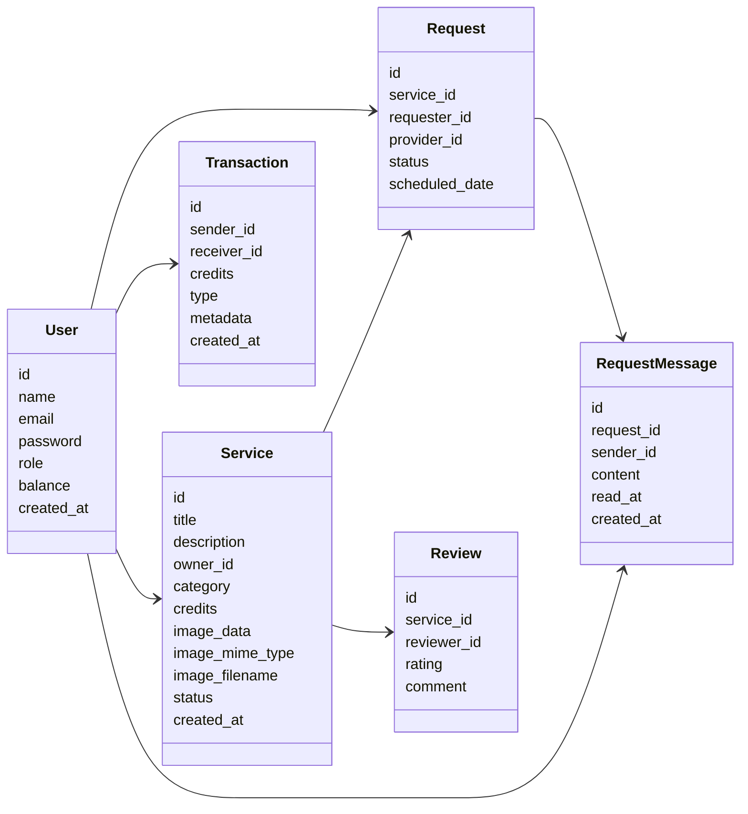
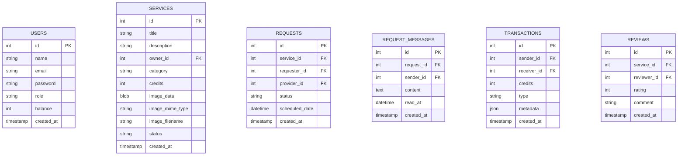
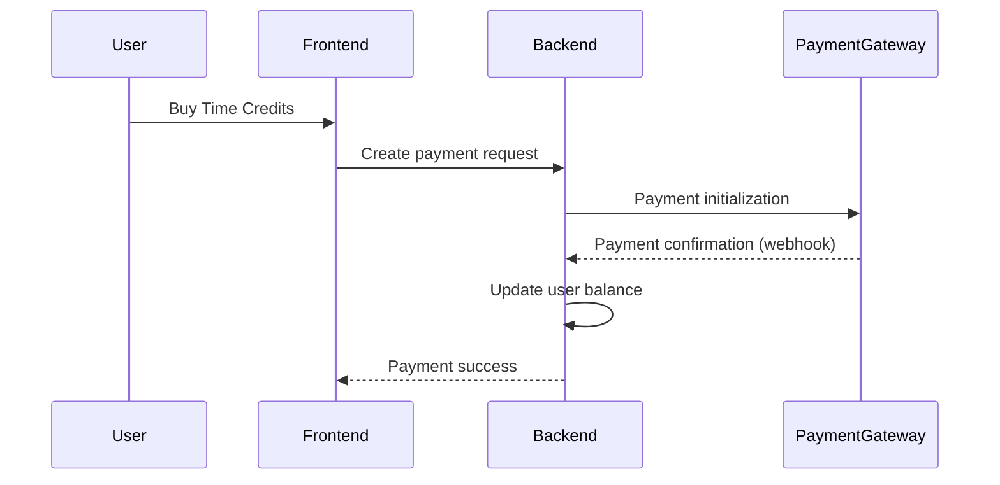
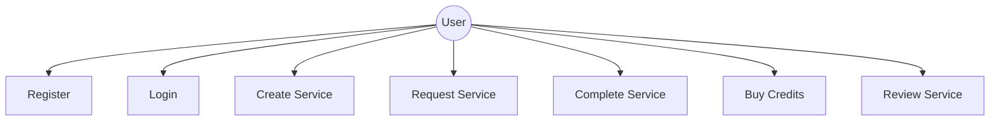
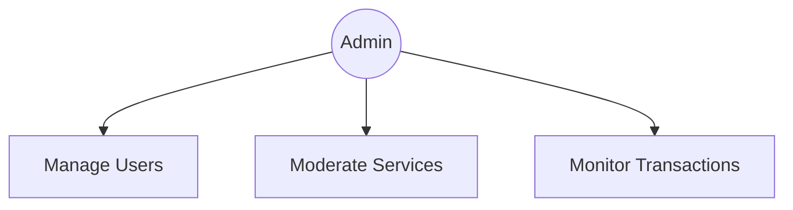
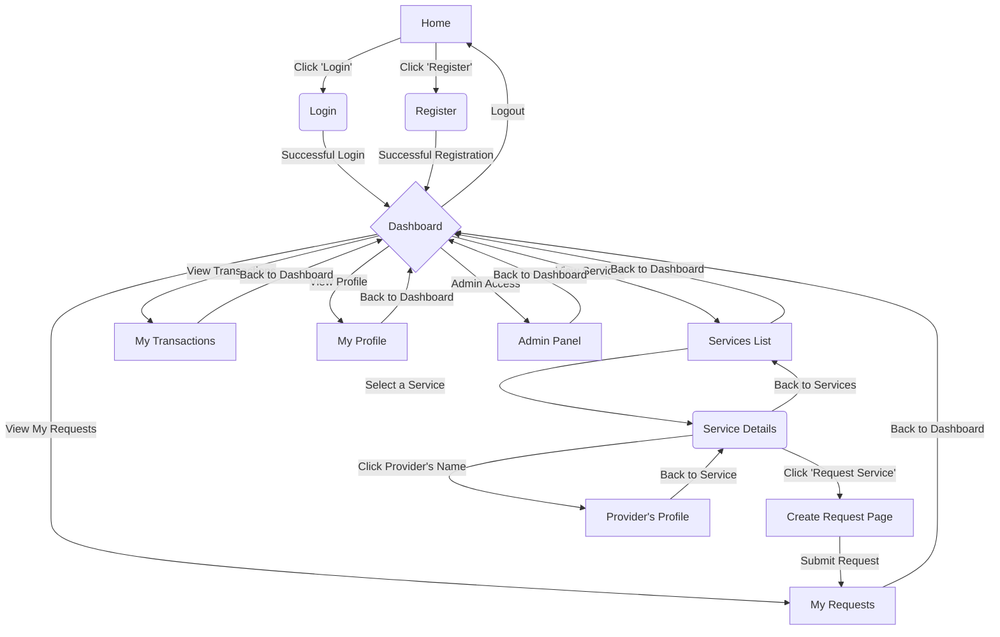
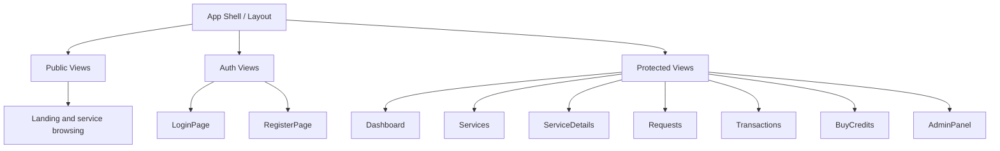

# 0. Team members

- Daniel Medina Negrete
- Javier Fernandez Del Amo

---
# 1. Project Overview

## 1.1 Introduction

The **Time Bank Platform** is a web-based peer-to-peer system that enables users to exchange services using a virtual currency called **time credits**. Instead of paying with traditional money, users earn credits by providing services and spend them when requesting services from other users.

The system is designed to promote collaboration, knowledge sharing, and mutual support within a community. Each hour of service provided corresponds to a specific number of time credits that can later be used to obtain services from other participants.

The application will follow modern web engineering practices, including:
- MVC architecture
- RESTful API design
- Token-based authentication
- Secure communication between services
- Modular and scalable design
- Responsive frontend interface

The system will also support integration with an external payment provider that allows users to purchase time credits.

Current backend capabilities also include service image uploads, request-level messaging, automatic credit transfers on completed requests, and admin tools for statistics, credit adjustments, and service moderation.

## 1.2 GitHub Repository

Project repository: [Time Bank repository](https://github.com/Dmedina-coder/Time-Bank)

# 0. Team Members

- Daniel Medina Negrete
- Javier Fernandez Del Amo

---
# 1. Project Overview

## 1.1 Introduction

The **Time Bank Platform** is a web-based peer-to-peer system that enables users to exchange services using a virtual currency called **time credits**. Instead of paying with traditional money, users earn credits by providing services and spend them when requesting services from other users.

The system is designed to promote collaboration, knowledge sharing, and mutual support within a community. Each hour of service provided corresponds to a specific number of time credits that can later be used to obtain services from other participants.

The application follows modern web engineering practices, including:
- MVC architecture
- RESTful API design
- Token-based authentication
- Secure communication between services
- Modular and scalable design
- Responsive frontend interface

The system also supports integration with an external payment provider that allows users to purchase time credits.

Current backend capabilities additionally include service image uploads, request-level messaging, automatic credit transfers on completed requests, and admin tools for statistics, credit adjustments, and service moderation.

---
# 2. Backend Structure (Python)

Suggested structure:

```
backend/              # Python/Flask backend
├── app/
│   ├── controllers/  # Controllers
│   ├── models/       # Data models
│   ├── services/     # Business logic
│   ├── routes/       # API routes
│   └── middleware/   # Middleware
├── main.py           # Entry point
└── requirements.txt  # Python dependencies
```

---
# 3. Frontend Structure (React)

```
frontend/            # React frontend
├── src/
│   ├── pages/       # Application pages
│   ├── components/  # Reusable components
│   ├── services/    # API services
│   └── context/     # Context API
└── package.json     # Node.js dependencies
```

---
# 4. Content Model (Class Diagram)


```mermaid
classDiagram
	direction LR

class User {
    id
    name
    email
    password
    role
    balance
    created_at
}

class Service {
    id
    title
    description
    owner_id
    category
    credits
    image_data
    image_mime_type
    image_filename
    status
    created_at
}

class Request {
    id
    service_id
    requester_id
    provider_id
    status
    scheduled_date
}

class RequestMessage {
    id
    request_id
    sender_id
    content
    read_at
    created_at
}

class Transaction {
    id
    sender_id
    receiver_id
    credits
    type
    metadata
    created_at
}

class Review {
    id
    service_id
    reviewer_id
    rating
    comment
}

User --> Service
User --> Request
User --> Transaction
Service --> Request
Request --> RequestMessage
Service --> Review
User --> RequestMessage
```

---
# 5. Database ER Diagram


```mermaid
erDiagram

USERS {
    int id PK
    string name
    string email
    string password
    string role
    int balance
    timestamp created_at
}

SERVICES {
    int id PK
    string title
    string description
    int owner_id FK
    string category
    int credits
    blob image_data
    string image_mime_type
    string image_filename
    string status
    timestamp created_at
}

REQUESTS {
    int id PK
    int service_id FK
    int requester_id FK
    int provider_id FK
    string status
    datetime scheduled_date
    timestamp created_at
}

REQUEST_MESSAGES {
    int id PK
    int request_id FK
    int sender_id FK
    text content
    datetime read_at
    timestamp created_at
}

TRANSACTIONS {
    int id PK
    int sender_id FK
    int receiver_id FK
    int credits
    string type
    json metadata
    timestamp created_at
}

REVIEWS {
    int id PK
    int service_id FK
    int reviewer_id FK
    int rating
    string comment
    timestamp created_at
}
```

---
# 6. REST API Dictionary

The backend API is organized into the following resource groups.

## 6.1 Endpoint Dictionary

| Resource | Method | Endpoint | Purpose |
| --- | --- | --- | --- |
| Authentication | POST | /api/auth/register | Creates an account and returns an access token |
| Authentication | POST | /api/auth/login | Authenticates a user |
| Authentication | POST | /api/auth/logout | Ends the current session |
| Users | GET | /api/users/me | Returns the authenticated user |
| Users | PUT | /api/users/me | Updates the authenticated user |
| Users | GET | /api/users/{user_id} | Returns a user by ID |
| Users | PUT | /api/users/{user_id} | Updates a user by ID with admin permissions |
| Services | GET | /api/services | Lists services with filters and pagination |
| Services | POST | /api/services | Creates a new service |
| Services | GET | /api/services/{service_id} | Returns a service detail |
| Services | PUT | /api/services/{service_id} | Updates a service |
| Services | POST | /api/services/{service_id}/image | Uploads a service image |
| Services | GET | /api/services/{service_id}/image | Returns a stored service image |
| Services | DELETE | /api/services/{service_id} | Marks a service as deleted |
| Requests | GET | /api/requests | Lists visible requests |
| Requests | POST | /api/requests | Creates a new request |
| Requests | GET | /api/requests/{request_id} | Returns a request detail |
| Requests | PUT | /api/requests/{request_id} | Updates a request |
| Requests | PUT | /api/requests/{request_id}/cancel | Cancels a request |
| Requests | PUT | /api/requests/{request_id}/accept | Accepts a request |
| Requests | PUT | /api/requests/{request_id}/reject | Rejects a request |
| Requests | PUT | /api/requests/{request_id}/complete | Completes a request and transfers credits |
| Request Messages | GET | /api/requests/{request_id}/messages | Lists request messages |
| Request Messages | POST | /api/requests/{request_id}/messages | Sends a request message |
| Request Messages | PUT | /api/requests/{request_id}/messages/{message_id}/read | Marks a message as read |
| Transactions | GET | /api/transactions | Lists visible transactions |
| Transactions | GET | /api/transactions/{transaction_id} | Returns a transaction detail |
| Transactions | POST | /api/transactions/transfer | Creates a transfer between users |
| Transactions | GET | /api/transactions/user/{user_id} | Returns a user's transaction history |
| Payments | GET | /api/payments/stripe/config | Returns public Stripe configuration |
| Payments | POST | /api/payments/stripe/payment-intent | Creates a payment intent |
| Payments | POST | /api/payments/stripe/confirm | Confirms a payment and credits the user |
| Administration | GET | /api/admin/stats | Returns system statistics |
| Administration | GET | /api/admin/users | Lists users with filtering |
| Administration | POST | /api/admin/users/{user_id}/credits | Adjusts user credits |
| Administration | PUT | /api/admin/services/{service_id}/approve | Approves a service |
| Administration | PUT | /api/admin/services/{service_id}/reject | Rejects a service |
| Reviews | POST | /api/reviews | Creates a review for a completed service |

## 6.2 Endpoint Details

### Authentication

- `POST /api/auth/register`: creates an account and returns `access_token` together with the user.
- `POST /api/auth/login`: authenticates a user and returns `access_token`, `token_type`, `expires_in`, and `user`.
- `POST /api/auth/logout`: requires authentication and returns a confirmation message.

### Users

- `GET /api/users/me`: returns the authenticated user.
- `PUT /api/users/me`: updates the authenticated user.
- `GET /api/users/{user_id}`: returns a user by ID.
- `PUT /api/users/{user_id}`: updates a user by ID with administrator permissions.

### Services

- `GET /api/services`: lists services with pagination and filters by category, search, and status.
- `POST /api/services`: creates a service with `title`, `description`, `category`, and optional `credits`.
- `GET /api/services/{service_id}`: returns the service detail, including the owner.
- `PUT /api/services/{service_id}`: updates service fields and status.
- `POST /api/services/{service_id}/image`: uploads a service image as `multipart/form-data`.
- `GET /api/services/{service_id}/image`: returns the stored service image.
- `DELETE /api/services/{service_id}`: marks the service as deleted.

### Requests

- `GET /api/requests`: lists requests visible to the authenticated user with pagination.
- `POST /api/requests`: creates a request for a service with `service_id` and `scheduled_date`.
- `GET /api/requests/{request_id}`: returns the request detail.
- `PUT /api/requests/{request_id}`: updates `scheduled_date` or `status`.
- `PUT /api/requests/{request_id}/cancel`: cancels a request.
- `PUT /api/requests/{request_id}/accept`: marks the request as `accepted`.
- `PUT /api/requests/{request_id}/reject`: marks the request as `rejected`.
- `PUT /api/requests/{request_id}/complete`: marks the request as `completed` and triggers the automatic credit adjustment.
- `GET /api/requests/{request_id}/messages`: lists messages with pagination.
- `POST /api/requests/{request_id}/messages`: sends a message within the request.
- `PUT /api/requests/{request_id}/messages/{message_id}/read`: marks a message as read.

### Transactions and Payments

- `GET /api/transactions`: lists transactions visible to the authenticated user with pagination.
- `GET /api/transactions/{transaction_id}`: returns a specific transaction.
- `POST /api/transactions/transfer`: creates a transfer between users.
- `GET /api/transactions/user/{user_id}`: returns the transaction history of a user.
- `GET /api/payments/stripe/config`: returns the public Stripe configuration.
- `POST /api/payments/stripe/payment-intent`: creates a PaymentIntent for buying credits.
- `POST /api/payments/stripe/confirm`: confirms a payment and credits the user.

### Administration

- `GET /api/admin/stats`: returns general system statistics.
- `GET /api/admin/users`: lists users with filtering by name or email.
- `POST /api/admin/users/{user_id}/credits`: adjusts user credits and records a system transaction.
- `PUT /api/admin/services/{service_id}/approve`: approves a service.
- `PUT /api/admin/services/{service_id}/reject`: rejects a service.

### Reviews

The schema includes the `reviews` entity, and the API reference documents the contract for creating reviews on completed services.

- `POST /api/reviews`: allows the requester of a completed service to create a review.

---
# 7. Payment Gateway Communication


```mermaid
sequenceDiagram
    participant User
    participant Frontend
    participant Backend
    participant PaymentGateway

    User->>Frontend: Buy Time Credits
    Frontend->>Backend: Create payment request
    Backend->>PaymentGateway: Payment initialization
    PaymentGateway-->>Backend: Payment confirmation (webhook)
    Backend->>Backend: Update user balance
    Backend-->>Frontend: Payment success
```


---
# 8. Use Case Diagram


```mermaid 
flowchart TB
    User((User))

    Register[Register]
    Login[Login]
    CreateService[Create Service]
    RequestService[Request Service]
    CompleteService[Complete Service]
    BuyCredits[Buy Credits]
    ReviewService[Review Service]

    User --> Register
    User --> Login
    User --> CreateService
    User --> RequestService
    User --> CompleteService
    User --> BuyCredits
    User --> ReviewService
```


```mermaid 
flowchart TB
    Admin((Admin))

    ManageUsers[Manage Users]
    ModerateServices[Moderate Services]
    MonitorTransactions[Monitor Transactions]

    Admin --> ManageUsers
    Admin --> ModerateServices
    Admin --> MonitorTransactions
```

---
# 9. Navigation Model (Frontend)


```mermaid
flowchart TB
    A[Home] --"Click 'Login'"--> B(Login)
    A --"Click 'Register'"--> C(Register)
    
    B --"Successful Login"--> D{Dashboard}
    C --"Successful Registration"--> D

    D --"View Services"--> E[Services List]
    D --"View My Requests"--> F[My Requests]
    D --"View Transactions"--> G[My Transactions]
    D --"View Profile"--> H[My Profile]
    D --"Admin Access"--> I[Admin Panel]
    D --"Logout"--> A

    E --"Select a Service"--> L(Service Details)
    L --"Click 'Request Service'"--> M[Create Request Page]
    L --"Click Provider's Name"--> N[Provider's Profile]
    
    M --"Submit Request"--> F
    N --"Back to Service"--> L
    
    E --"Back to Dashboard"--> D
    F --"Back to Dashboard"--> D
    G --"Back to Dashboard"--> D
    H --"Back to Dashboard"--> D
    I --"Back to Dashboard"--> D
    L --"Back to Services"--> E
```

---
# 10. Presentation Model (Frontend)

The frontend presentation model is organized around reusable components and page-level views.


```mermaid
flowchart TB
    Layout[App Shell / Layout]
    Public[Public Views]
    Auth[Auth Views]
    Private[Protected Views]

    Layout --> Public
    Layout --> Auth
    Layout --> Private

    Public --> Home[Landing and service browsing]
    Auth --> Login[LoginPage]
    Auth --> Register[RegisterPage]
    Private --> Dashboard[Dashboard]
    Private --> Services[Services]
    Private --> Details[ServiceDetails]
    Private --> Requests[Requests]
    Private --> Transactions[Transactions]
    Private --> BuyCredits[BuyCredits]
    Private --> Admin[AdminPanel]
```

## Presentation Components

- Navbar: global navigation and session actions.
- ServiceCard: service summary in listings.
- RequestChat: request-level messaging interface.
- ReviewComponent: service review form and display.
- ProtectedRoute: guards authenticated views.

## Presentation Pages

- Dashboard: overview of balance, requests, services, and activity.
- Services: searchable catalog of services.
- ServiceDetails: detailed service view and request entry point.
- Requests: incoming and outgoing request management.
- Transactions: credit history and movement tracking.
- BuyCredits: payment and credit purchase flow.
- AdminPanel: moderation and operational controls.

---
# 11. Security Model

Authentication method:

* JWT tokens
* Token stored securely in the frontend
* Middleware validation

Security measures:

* Password hashing (bcrypt)
* Input validation
* Role-based access control
* HTTPS
* Rate limiting

---
# 12. Mockups

## Login

![[login.jpg|506]]

A simple login page where users can access the system by entering their username and password. The design focuses on clarity and ease of use to ensure quick and secure authentication.
## Register

![[register.jpg|504]]

A basic user registration interface that allows new users to create an account by providing essential information. The layout is straightforward, making the onboarding process fast and intuitive.
## Dashboard

![[WhatsApp Image 2026-03-24 at 18.03.50.jpg|226]]

This screen presents the main user dashboard, offering an overview of the most relevant information. Users can view their available hour balance, recent activity, the number of services they currently offer, and any pending requests. The dashboard is designed to centralize key data and improve navigation throughout the platform.
## Service Search

![[Services.jpg|223]]

A service search interface where users can browse and filter available services. Additionally, there is a button that allows users to publish a new service quickly. The focus is on helping users find what they need efficiently while also encouraging service creation.
## Request Management

![[Requests.jpg|221]]

This final screen corresponds to the management of both received and sent requests. It displays summarized information for each request, allowing users to review details at a glance. From here, users can take action on any request, such as accepting it.

---

# 13. GitHub URL

[Time Bank repository](https://github.com/Dmedina-coder/Time-Bank)

---
# 14. Sprint-Based Implementation Plan

## Sprint 1 — Foundations & Security

* Authentication system
* JWT implementation
* User management
* Basic API
* MVC architecture setup

## Sprint 2 — Core Platform

* Services marketplace
* Requests workflow
* Credits system
* Transactions
* Service discovery

## Sprint 3 — Advanced Features

* Payment gateway integration
* Reviews & ratings
* Admin panel
* Monitoring tools
